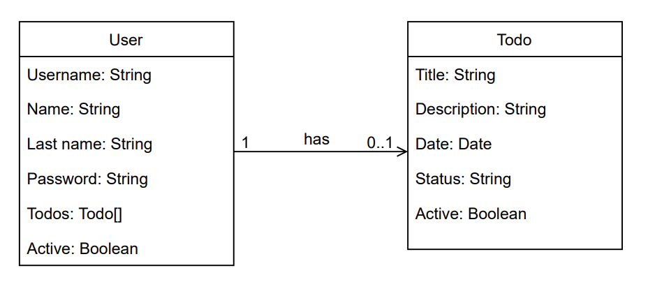

# To Do API

## Contributors
<!-- Contributors table START -->
| [<br /><sub>Oswaldo Osuna</sub>](https://ososuna.dev)<br />🐈‍⬛  ☕️ 🤠 | [<br /><sub>Ivan Mendoza</sub>](https://github.com/ivansmb11)<br />🍺  🤓  💻  |
| :---: | :---: |
<!-- Contributors table END -->

## Requirements

For building and running the application you need:

- [JDK 11.0](https://www.oracle.com/mx/java/technologies/javase/jdk11-archive-downloads.html)
- [Maven 3](https://maven.apache.org)


## Running the application locally

There are several ways to run a Spring Boot application on your local machine. One way is to execute the `main` method in the `com.beer.api.beer.BeerApplication` class from your IDE.

Alternatively you can use the [Spring Boot Maven plugin](https://docs.spring.io/spring-boot/docs/current/reference/html/build-tool-plugins-maven-plugin.html) like so:

```shell
mvn spring-boot:run
```

## Try it out with Docker

First, build the application:

```shell
mvn package
```

Then you need to build the Docker image:

```shell
docker build -t to-do-api .
```
  
Now you can run the image:
  
```shell
docker run --name to-do-api -p 3001:3001 to-do-api
```

## Class Diagram
